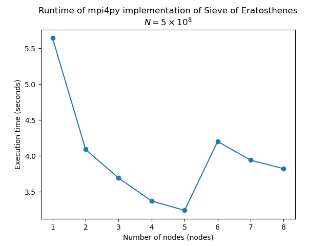

# Single process output
Looking at the following profiler output:

```log
9 function calls in 0.001 seconds

Ordered by: standard name

ncalls  tottime  percall  cumtime  percall filename:lineno(function)
    1    0.000    0.000    0.000    0.000 <__array_function__ internals>:177(copyto)
    1    0.000    0.000    0.001    0.001 <string>:1(<module>)
    1    0.001    0.001    0.001    0.001 assignment3.py:19(sieve_erat)
    1    0.000    0.000    0.000    0.000 multiarray.py:1079(copyto)
    1    0.000    0.000    0.000    0.000 numeric.py:150(ones)
    1    0.000    0.000    0.001    0.001 {built-in method builtins.exec}
    1    0.000    0.000    0.000    0.000 {built-in method numpy.core._multiarray_umath.implement_array_function}
    1    0.000    0.000    0.000    0.000 {built-in method numpy.empty}
    1    0.000    0.000    0.000    0.000 {method 'disable' of '_lsprof.Profiler' objects}
```

It looks like the sieve_erat function I made takes up the most time. The function found primes up until 4000. It's hard to determine the distribution of the runtimes becasue everything is around 0 seconds.

# Using MPI, Ntasks and Nodes
## Ntasks
Here, I added another function to assignment3.py to include an MPI implementation of the Sieve of Eratosthenes.  Below is a plot of the execution time of this function against the number of tasks.


Initially, there is a steep drop off in how long it takes for the algorithm to complete. The changes in execution time keep getting smaller until stabilizing around the 8 tasks mark. I think the scaling makes sense, because each iteration is relatively smaller than the previous change.
 
For example, the second iteration spreads the workload over two proceses, effecitvely reducing the work per process by half, so n/2. Then, the third iteration splits the work into three, so N/3. However, this is a relatively smaller change from iteration two to three, N/3 being only 2/3rd of N/2, or a 1/3rd decrease of N/2. 

This may also explain why it stabilizes at a certain point. THe work has become so small that splitting it up any further only reduces the work a processor needs to do by very little. In fact, the time added from increased networking and traffic the cluster needs to manage may outpace the reduction in work as the number of tasks increases.  As N increases, the ntasks at which exeuction time stabilizes increases.

## Nodes
Then, instead of increasing the number of tasks, I have increased the number of nodes (with one task per node). 



The same principle as before applies. However, increasing the number of nodes does not seem to decrease execution time as much as an increase in number of tasks does. I believe this may be attributed to my suspicion that communication of processes between different nodes, is more taxing than communication between processes on the same node. It does seem to stabilize around the same point.